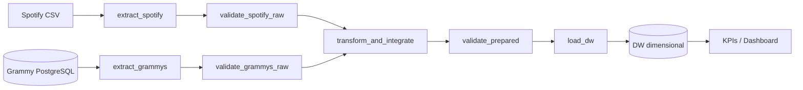
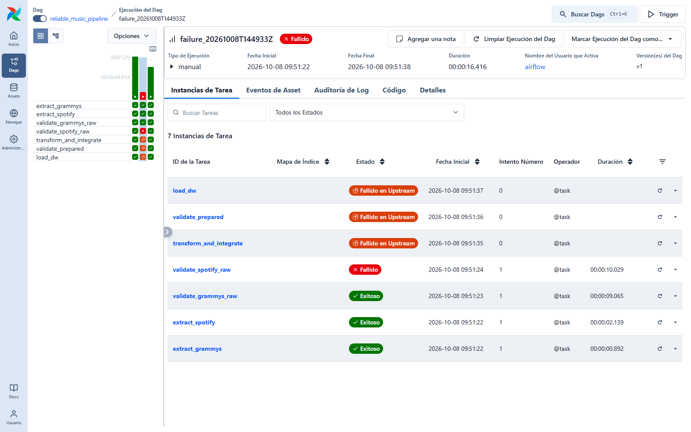
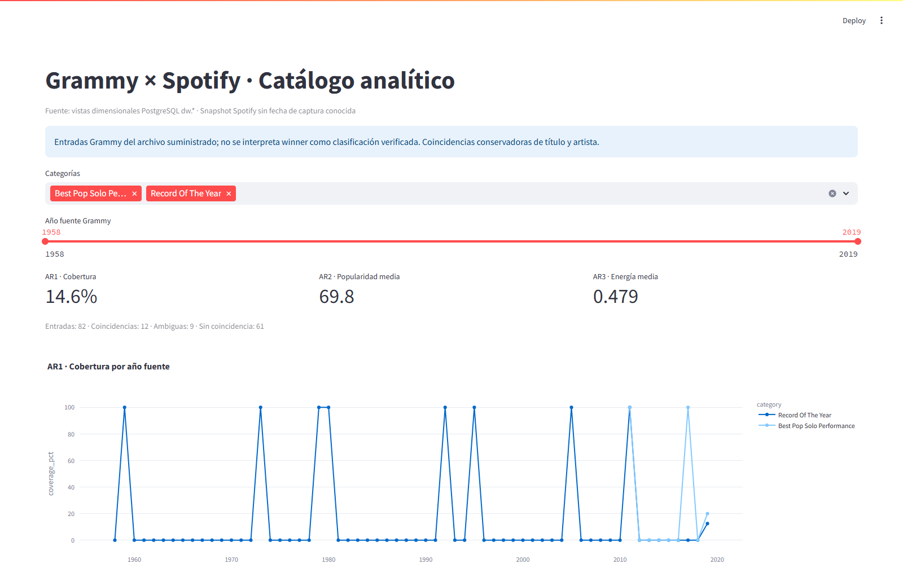

# Workshop 2 · Pipeline batch confiable de música

Integración de **Spotify CSV + Grammy en PostgreSQL**, orquestada por **Apache Airflow 3.1.8**, con **Great Expectations 1.8.0**, Data Warehouse dimensional y dashboard conectado al DW.

## Inicio rápido en macOS

Con Docker Desktop abierto, Git y Python 3 instalados:

```bash
git clone git@github.com:danielferparradiaz/workshop2-ETL-2026-2.git
cd workshop2-ETL-2026-2
python3 -m scripts.bootstrap
```

Los **dos datasets están incluidos en el repositorio**. Bootstrap verifica sus hashes, genera credenciales locales, construye/arranca Docker, prepara Grammy en PostgreSQL y ejecuta las pruebas de éxito, fallo controlado y rerun. Luego abrir **http://localhost:8082** (Airflow) y **http://localhost:8502** (dashboard).

Las imágenes base tienen versiones Intel y ARM64 para Apple Silicon. [Guía macOS: requisitos, pasos manuales, notebook y diagnóstico](docs/macos.md). En Windows también puede usarse `py -3.12 -m scripts.bootstrap` desde la raíz del clon.

## Objetivo y alcance

Analizar cobertura en el catálogo Spotify, popularidad y características musicales de entradas Grammy en **Record Of The Year** y **Best Pop Solo Performance**. Son categorías de grabaciones; el alcance evita mezclar álbumes o premios a artistas con pistas.

| ID | Requerimiento | KPI | Visualización |
|---|---|---|---|
| AR1 | Cobertura del catálogo suministrado sobre las entradas Grammy seleccionadas | % de entradas con match único | Línea por año/categoría |
| AR2 | Popularidad del snapshot Spotify de entradas Grammy emparejadas | Popularidad media | Barras por categoría |
| AR3 | Perfil musical de entradas Grammy emparejadas | Energía media | Scatter energía/bailabilidad |

Cada salida usa datos de ambas fuentes y consulta el DW. [Requerimientos completos y atributos](docs/requirements.md).

## Estado verificado

- Airflow reporta **3.1.8**; DAG de siete tareas con TaskFlow público `airflow.sdk`.
- **114.000 filas Spotify**, **4.810 filas Grammy** importadas a SQL con reconciliación de todas las celdas.
- Ejecuciones reales: baseline exitoso, fallo crítico controlado y rerun exitoso, con estados, logs, resultados GX y capturas preservados.
- DW: **82 entradas en alcance**, **12 matched**, **61 unmatched**, **9 ambiguous**.
- KPIs del lote: **14,63 % cobertura**, **69,83 popularidad media**, **0,479 energía media**.
- Rerun conserva conteos, medidas y hash del contenido del DW. Seis pruebas unitarias pasan y notebook ejecutado.

**Herramienta BI avalada:** el dashboard de la entrega usa Streamlit. El estudiante confirmó el aval docente el 8 de octubre de 2026, conforme a la opción de herramienta alternativa aprobada del enunciado. La conexión Power Query, las medidas DAX y la guía Power BI quedan como material complementario. [Detalle de BI](docs/dashboard.md).

## Fuentes y hallazgos

Originales incluidos en `data/input/spotify_dataset.csv` y `data/input/the_grammy_awards.csv`. [Hashes y tamaños](docs/evidence/input_manifest.json). `.gitattributes` preserva sus bytes entre sistemas operativos; `python3 -m scripts.verify_inputs` valida la integridad después de clonar. No se sustituyen por otras versiones ni requieren Git LFS.

Spotify repite track_id en 24.259 filas y tiene **720 IDs con atributos conflictivos**. Una fila carece de nombre/artista. Grammy tiene **winner=True en las 4.810 filas**, incluso varias entradas de un mismo año/categoría. Por eso `winner` no sustenta una comparación de ganadores contra no ganadores.

El [notebook ejecutado](notebooks/data_profiling.ipynb) examina estructura, completitud, unicidad, categorías, distribuciones, temporalidad y compatibilidad. [Hallazgos y riesgos](docs/profiling_findings.md) · [perfil JSON](docs/evidence/profile.json).

## Arquitectura



Grammy CSV se importa a `music.source.grammy` como **preparación de fuente**, antes del DAG. La extracción operacional hace SELECT desde PostgreSQL; `load_dw` escribe en `music.dw`, un destino distinto. Metadata Airflow reside en otra base (`airflow`).

Los tasks intercambian rutas mediante XCom. Parquet y JSON se guardan por run ID en `data/runs/`. `all_success` bloquea integración si falla alguna rama y bloquea carga si falla preparado. [Arquitectura, interfaces y logging](docs/architecture.md).

## Calidad, integración y modelo

**GX:** suites separadas para Spotify raw, Grammy raw y preparado; DataFrame Assets, Batch Definitions y Validation Definitions explícitas. Resultados completos y suites serializadas quedan en JSON, con Rule ID, severidad y evidencia por Expectation. Critical detiene; Warning se registra y continúa bajo política. [Tabla de reglas y umbrales](docs/quality_rules.md).

**Transformación:** normalización NFKC/casefold/espacios, colapso de IDs compatibles, cuarentena de claves faltantes/IDs conflictivos, delimitación de categorías y matching exacto título+artista. Cero candidatos produce unmatched, uno matched y varios ambiguous. No se selecciona una versión arbitraria ni se imputan medidas como cero. [Contrato completo y reconciliación](docs/integration.md).

**Estrella:** `fact_grammy_catalog` con una fila por entrada literal `(year,category,nominee,artist)` y dimensiones `dim_year`, `dim_category`, `dim_artist`, `dim_track`. Clave de negocio hash, claves sustitutas y relaciones FK. Medidas nulas para entradas sin pista asignada. [Modelo y grano](docs/model.md) · [DDL ejecutable](sql/dw_schema.sql).

**Repetibilidad:** snapshot completo en transacción PostgreSQL con advisory lock, TRUNCATE de tablas relacionadas y reinserción. Si falla la transacción, vuelve el snapshot anterior. Una nueva corrida no acumula hechos. `load_audit` registra conteos y sumas de control. No se conservan snapshots históricos en la tabla de hechos.

## Preparar y ejecutar (PowerShell)

Requisitos: Docker Desktop funcionando con contenedores Linux y Compose v2; Python 3.12 solo para herramientas locales. La primera construcción descarga imágenes y dependencias. Ejecutar desde la carpeta de este repositorio.

```powershell
# Verificar los originales incluidos en el clon:
py -3.12 -m scripts.verify_inputs

# Genera .env local con valores aleatorios. Solo la primera vez:
py -3.12 -m scripts.configure

docker compose config --quiet
docker compose build
docker compose up -d
docker compose exec -T airflow-scheduler python -m scripts.wait_ready
docker compose ps
docker compose exec -T airflow-scheduler airflow version

# Preparación de la fuente relacional:
docker compose exec -T airflow-scheduler python -m scripts.prepare_source
docker compose exec -T airflow-scheduler airflow dags list-import-errors

# Ejecuta y verifica los 3 DAG Runs reales: éxito, fallo y rerun:
docker compose exec -T airflow-scheduler python -m scripts.reliability
docker compose exec -T airflow-scheduler python -m scripts.verify_runtime
```

Si `.env` ya existe, `scripts.configure` rechaza sobrescribirlo: continuar con los pasos Docker. `.env.example` documenta las variables. Si el DAG aún no aparece al arrancar, esperar su primer parseo y volver a ejecutar la comprobación de importación.

### Interfaces

| Servicio | Dirección / conexión |
|---|---|
| Airflow UI | http://localhost:8082 |
| Dashboard | http://localhost:8502 |
| PostgreSQL desde el host (macOS/Windows) | localhost:5434; base music; usuario workshop; contraseña en `.env` |
| PostgreSQL entre contenedores | postgres:5432 |

Airflow usa SimpleAuthManager en modo all-admin **solo local**, sin contraseña de UI; los puertos están vinculados a loopback. El primer acceso puede redirigir a Inicio; luego abrir el DAG. No se expone como despliegue de producción.

### Ejecución manual desde UI

1. Abrir `reliable_music_pipeline`, activarlo y usar **Trigger**.
2. `scenario=normal` ejecuta el flujo regular.
3. `scenario=invalid_popularity` altera una copia raw a 101 y demuestra **S05-popularity**. Preservar esta corrida fallida; la original permanece intacta.
4. Volver a `normal` en una nueva corrida. Revisar Grid, tarea fallida y logs; la UI debe mostrar la política real, no solo un grafo conectado.

### Notebook y pruebas locales

```powershell
py -3.12 -m venv .venv
.\.venv\Scripts\python.exe -m pip install -r requirements-dev.txt
.\.venv\Scripts\python.exe -m pytest -q
.\.venv\Scripts\python.exe -m scripts.execute_notebook
```

El notebook necesita PostgreSQL y la preparación de fuente completada; obtiene la contraseña del `.env` local sin imprimirla. No instalar Airflow completo en Windows: Airflow corre en Docker.

### Operación

```powershell
docker compose logs airflow-scheduler airflow-dag-processor
docker compose exec -T postgres psql -U workshop -d music -c "SELECT * FROM dw.v_kpis;"
docker compose stop
docker compose start
```

Los datos PostgreSQL persisten en un volumen nombrado; logs y artefactos permanecen en carpetas locales. `scripts.prepare_source` reemplaza únicamente la fuente Grammy de este proyecto y es transaccional. El loader reemplaza únicamente el snapshot dimensional del proyecto.

## Evidencias y resultados

Consultar el [registro con interpretación](docs/evidence/README.md) y [resumen machine-readable](docs/evidence/latest_reliability.json).

| Caso | Run ID preservado | Resultado |
|---|---|---|
| Test A | baseline_20261008T144933Z | 7 tareas success; carga de 82 hechos |
| Test B | failure_20261008T144933Z | validate_spotify_raw failed; transform/prepared/load upstream_failed, 0 intentos |
| Rerun | rerun_20261008T144933Z | 7 tareas success; mismo contenido del DW |

Las validaciones y transformaciones deterministas tienen 0 retries; extracción SQL y carga permiten 2 reintentos con backoff solo para OperationalError. Otros errores en esas tareas usan AirflowFailException. [Política de fallo/retry](docs/architecture.md).





## Cumplimiento del enunciado

Cobertura explícita de `ETL/ETL_2026-2_Workshop-2.pdf`. Cada requisito del enunciado se responde en una sección o artefacto del repositorio; una falta de prueba exigida equivaldría a una capacidad de sistema ausente, no a un vacío de documentación.

### Requisitos de README (§9.2 del enunciado)

| Requisito | Dónde se responde |
|---|---|
| Problema y objetivo analítico | [Objetivo y alcance](#objetivo-y-alcance) |
| Requerimientos analíticos | [Requerimientos y atributos](docs/requirements.md) (AR1–AR3) |
| Fuentes de datos | [Fuentes y hallazgos](#fuentes-y-hallazgos) · [manifiesto original](docs/evidence/input_manifest.json) |
| Arquitectura del pipeline | [Arquitectura](#arquitectura) · [diagrama y límites](docs/architecture.md) |
| Hallazgos de perfilamiento | [notebook ejecutado](notebooks/data_profiling.ipynb) · [riesgos](docs/profiling_findings.md) · [perfil JSON](docs/evidence/profile.json) |
| Riesgos de calidad y reglas | [tabla de reglas, métricas, umbrales y severidades](docs/quality_rules.md) |
| Diseño de validación GX | [ejecución GX](docs/quality_rules.md) (Suites, Validation Definitions y resultado) |
| Estrategia de transformación e integración | [contrato de integración](docs/integration.md) |
| Modelo dimensional | [modelo](docs/model.md) · [DDL ejecutable](sql/dw_schema.sql) |
| Diseño del DAG Airflow | [dags/reliable_music_pipeline.py](dags/reliable_music_pipeline.py) · [política en arquitectura](docs/architecture.md) · [chequeos de runtime](docs/evidence/runtime_checks.json) |
| Política de fallos y retries | [tabla de fallos y retries](docs/architecture.md) |
| Evidencia de ejecución exitosa | Test A (baseline) en [Evidencias](#evidencias-y-resultados) |
| Evidencia de fallo controlado | Test B (failure) en [Evidencias](#evidencias-y-resultados) |
| Estrategia de repetibilidad | [carga idempotente](docs/model.md) · [hash del DW](docs/evidence/latest_reliability.json) |
| Dashboard y salidas analíticas | [dashboard y KPIs](docs/dashboard.md) · consultas en `sql/analytics.sql` |
| Instrucciones de instalación y ejecución | [Preparar y ejecutar (PowerShell)](#preparar-y-ejecutar-powershell) · [macOS](docs/macos.md) |
| Supuestos y limitaciones | [Supuestos y limitaciones](#supuestos-y-limitaciones) |

### Evidencias requeridas (§4–§8)

| Evidencia pedida | Artefacto |
|---|---|
| Extracción Grammy desde base relacional, no del CSV | [source_import.json](docs/evidence/source_import.json) · `extract_grammys` hace SELECT sobre `source.grammy` |
| Tabla de requerimientos, alcance y trazabilidad | [requirements.md](docs/requirements.md) · [traceability.md](docs/traceability.md) |
| Perfilamiento reproducible de ambas fuentes | [notebook](notebooks/data_profiling.ipynb) · [profile.json](docs/evidence/profile.json) |
| Mapeo de cada Expectation a su Rule ID y resultados | [quality_rules.md](docs/quality_rules.md) · `gx_spotify_raw.json`, `gx_grammy_raw.json`, `gx_prepared.json` por run |
| Gates raw exitosos y un fallo crítico controlado | Test B: `S05-popularity` en [gx_spotify_raw.json](docs/evidence/20261008T155343Z/failure_20261008T155343Z/gx_spotify_raw.json) |
| Fallo crítico ligado a su Rule ID, estado y log | [evidence/README.md](docs/evidence/README.md) (E06–E07) · `task_logs/` del run failure |
| Suite de preparado distinta y carga bloqueada por su Critical | `gx_prepared.json` · dependencia `load_dw ← validate_prepared` |
| KPIs y visualizaciones consultando el DW | `dw.v_entries`, `dw.v_kpis` · [screenshot del dashboard](docs/evidence/screenshots/dashboard.png) |
| Conjunto mínimo de evidencia (§8.3) | [registro E01–E12](docs/evidence/README.md) |

### Diseño de validación GX (§6.6)

| Elemento | Implementación |
|---|---|
| Expectation | Reglas en [src/validation.py](src/validation.py) con `meta.rule_id` y `meta.severity` |
| Expectation Suite | Una suite por capa: `spotify_raw`, `grammy_raw`, `prepared` |
| Validation Definition | Contexto ephemeral + DataFrame Asset + Batch Definition, asociados con `gx.ValidationDefinition` |
| Ejecución controlada | `ValidationDefinition.run` (equivalente al Checkpoint), con política Critical detiene / Warning registra |
| Resultado | Success global y evidencia por regla (métricas y muestras) conservados en `gx_<capa>.json` |

### Pruebas obligatorias de confiabilidad (§7)

| Prueba | Run preservado | Resultado verificado |
|---|---|---|
| Test A · éxito | `baseline_20261008T144933Z` y `baseline_20261008T155343Z` | 7 tareas success; carga de 82 hechos |
| Test B · fallo crítico controlado | `failure_20261008T144933Z` y `failure_20261008T155343Z` (`scenario=invalid_popularity`) | `validate_spotify_raw` falla por `S05-popularity` (101); downstream `upstream_failed` con 0 intentos |
| Test C · rerun seguro | `rerun_20261008T144933Z` y `rerun_20261008T155343Z` | Mismos conteos, sumas de control y SHA-256 del contenido del DW |

### Criterios de evaluación (§10.1)

| Criterio | Evidencia en el repositorio |
|---|---|
| Requerimientos analíticos y arquitectura (0,40) | [requirements](docs/requirements.md) · [traceability](docs/traceability.md) · [architecture](docs/architecture.md) |
| Perfilamiento y análisis de riesgo (0,60) | [notebook](notebooks/data_profiling.ipynb) · [profile.json](docs/evidence/profile.json) · [riesgos](docs/profiling_findings.md) |
| ETL, transformación e integración (0,60) | [contrato](docs/integration.md) · `reconciliation.json` y `match_candidates.json` por run |
| Validación automática con GX (0,80) | [reglas](docs/quality_rules.md) · resultados `gx_*` de raw y prepared |
| Orquestación y confiabilidad Airflow (0,90) | [DAG](dags/reliable_music_pipeline.py) · fallos/retries · Tests A/B/C con capturas y logs |
| DW dimensional y analítica (0,40) | [modelo](docs/model.md) · [dw_schema.sql](sql/dw_schema.sql) · [dashboard](docs/dashboard.md) |
| Repositorio y documentación (0,30) | README · `.env.example` · estructura documentada · [registro de evidencias](docs/evidence/README.md) |

## Organización

```text
dags/               DAG TaskFlow de 7 tareas
src/                extracción, validación GX, transformación, carga, perfilamiento
scripts/            preparación, ejecución de pruebas reales y captura de evidencia
notebooks/          perfilamiento ejecutado
sql/                fuente, estrella y consultas analíticas
dashboard/          Streamlit + conexión/medidas para Power BI
docs/               decisiones, reglas, trazabilidad, evidencias
tests/              contratos críticos de matching y calidad
data/input/         originales incluidos, con SHA-256 verificado
data/runs/          artefactos por ejecución (no versionados)
```

[Matriz end-to-end](docs/traceability.md) · [Guía para exposición](docs/defense.md).

## Supuestos y limitaciones

- El archivo Grammy no demuestra exhaustividad de nominaciones ni permite separar ganadores/no ganadores de forma confiable. Se analizan entradas registradas.
- Solo se estudian dos categorías de grabaciones. El match exacto conservador tiene baja cobertura; medias basadas en 12 entradas no representan toda la población.
- Fecha de captura Spotify desconocida; no se infiere popularidad histórica, causalidad ni fecha de lanzamiento a partir del año Grammy.
- Créditos textuales no son identidades universales de personas; sufijos/versiones se preservan.
- Carga full snapshot adecuada al tamaño del taller; no implementación incremental ni historización de medidas.

## Referencias técnicas

- [Airflow 3.1.8 Docker](https://airflow.apache.org/docs/apache-airflow/3.1.8/howto/docker-compose/index.html)
- [Interfaz pública Airflow](https://airflow.apache.org/docs/apache-airflow/3.1.8/public-airflow-interface.html)
- [Great Expectations Core](https://docs.greatexpectations.io/docs/core/introduction/)
- Enunciado local: `ETL/ETL_2026-2_Workshop-2.pdf` (fuera de este repositorio).
