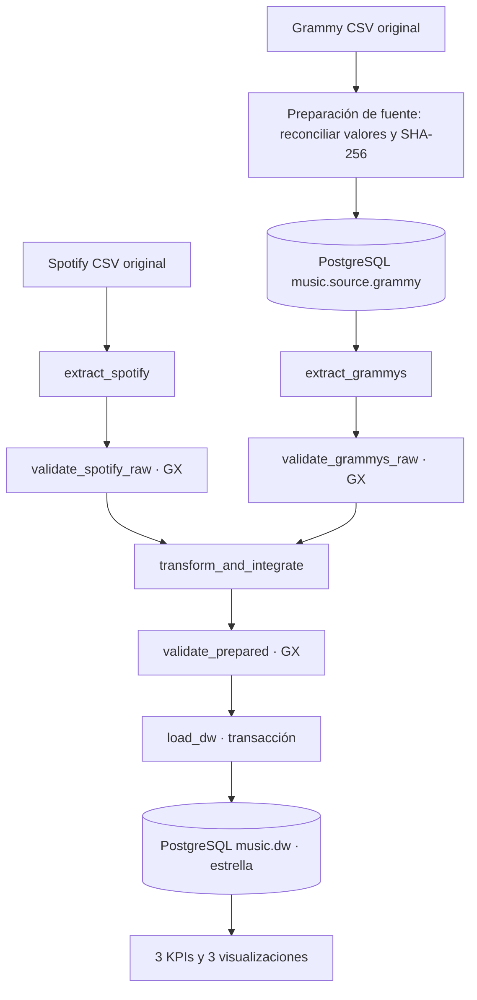

# Arquitectura y límites operativos

Airflow **3.1.8**, TaskFlow público `airflow.sdk`, LocalExecutor, servicios API/UI, scheduler y dag-processor. PostgreSQL aloja dos bases: `airflow` para metadata y `music` para datos. En `music`, `source` y `dw` tienen tablas y responsabilidades diferentes. Esta separación lógica no implica servidores físicos distintos.

La preparación de Grammy ocurre fuera del DAG, una vez por versión del archivo, con transacción y comparación de **todas las celdas** del CSV y SQL. Su importación preserva strings y vacíos; añade un ID de línea de datos para trazabilidad. El DAG solo ejecuta SELECT en la tabla fuente. Los originales conservan su SHA-256.

Las ramas raw tienen ejecución y resultados GX independientes. El trigger rule predeterminado `all_success` impide integrar hasta que ambas pasen la política. Warning puede producir `gx_success=false` y `policy_success=true`: esto es una decisión explícita, no un resultado ignorado. Critical lanza `QualityError` después de persistir la evidencia.

Interfaces: XCom contiene rutas de Parquet o un resumen de carga pequeño. Los DataFrames permanecen en `data/runs/<hash de run_id>`, montado en los contenedores. CSV original, extracción sin limpieza, cuarentena, preparado y JSON de evidencias quedan separados. Cada DAG Run tiene su namespace; `max_active_runs=1` y lock de PostgreSQL evitan escritores concurrentes.

## Fallos y retries

| Condición | Acción | Retry | Motivo |
|---|---|---|---|
| CSV faltante, parseo inválido | Falla extracción Spotify | 0 | Requiere corregir archivo/ruta |
| Error operacional SQL en extracción/carga | Falla intento, reintenta | 2; base 20 s, backoff exponencial | Posible indisponibilidad temporal |
| Otros errores de extracción SQL/carga | AirflowFailException | 0 efectivos | No repetir errores de contrato o programación |
| Critical GX raw | Falla gate; downstream upstream_failed | 0 | Datos iguales reproducen el fallo |
| Critical GX preparado | Falla gate; bloquea load_dw | 0 | Protege integridad del DW |
| Warning GX | Log + JSON, continuar | No aplica | Se mide y aplica la política documentada |
| Fallo a mitad de carga | Rollback completo | Solo OperationalError | Rerun reconstruye snapshot de manera atómica |

`OperationalError` es una aproximación a fallos transitorios; una mala configuración de conexión puede agotar los dos reintentos y requiere corrección. No se afirma haber simulado una caída de red. Sí se verificó fallo determinista con un solo intento y se inspeccionó la configuración selectiva de los tasks.

## Observabilidad

Airflow registra run/task, tiempos, estados, intentos y excepciones. Las funciones registran filas, rutas, Rule ID y carga. Cada extracción guarda procedencia (CSV+hash o SQL+manifiesto de importación), cada gate el detalle GX, y la integración una reconciliación de conteos y lista de candidatos. `load_audit` guarda resultados por run. La UI se enlaza al mismo run ID de las evidencias exportadas.

UI de desarrollo vinculada a `127.0.0.1:8082`, con SimpleAuthManager all-admin local sin contraseña; no usar esta configuración para exposición pública. PostgreSQL local: 5434; dashboard: 8502. Los valores reales de `.env` son generados y excluidos de Git.
