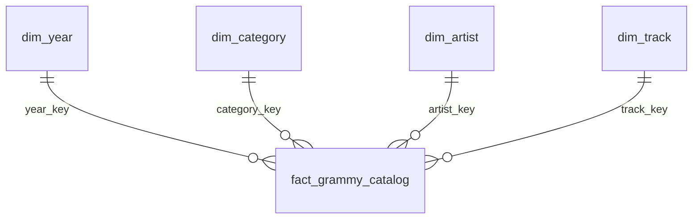

# Modelo dimensional (definido antes de transformar)

Proceso: presencia en el catálogo Spotify de entradas Grammy de grabaciones en las dos categorías en alcance (AR1–AR3).

**Grano:** una entrada Grammy única por `(year, category, nominee, artist)` literal. Se conserva su `source_row_id` para auditoría; un SHA-256 de la clave de negocio, codificada como arreglo JSON, identifica el hecho de forma reproducible. No se afirma que cada fila sea un ganador o que el archivo tenga todas las nominaciones.

Dimensiones: `dim_year` (año fuente como clave natural), `dim_category` (categoría), `dim_artist` (crédito literal Grammy, puede ser colectivo), `dim_track` (track_id Spotify, título y crédito Spotify). Categoría, artista y pista usan claves sustitutas enteras. Miembro pista 0 = sin pista asignada. El crédito no es una identidad universal de persona.

Hecho `fact_grammy_catalog`: claves foráneas, clave de negocio única, estado de enlace, número de candidatos, indicador de coincidencia, popularidad, energía, bailabilidad. Medidas Spotify son nulas para unmatched/ambiguous; todas provienen de una única pista elegible cuando hay match. Conteo de entradas = COUNT(*); cobertura = AVG(matched)*100; popularidad y energía = AVG de medidas no nulas. El dashboard muestra n y estados para contextualizar las medias.

Carga snapshot completa dentro de una única transacción PostgreSQL: TRUNCATE de hechos y dimensiones relacionados, inserción de dimensiones, hechos y auditoría. Las vistas se conservan. Una excepción produce rollback al snapshot anterior. No se conserva historia de snapshots en el hecho; `load_audit` guarda conteos y medidas por ejecución. Un advisory lock serializa escritores. Claves sustitutas se reconstruyen; los consumidores no deben persistirlas fuera del DW. Una reejecución con iguales fuentes reproduce hechos y medidas sin acumular filas.
